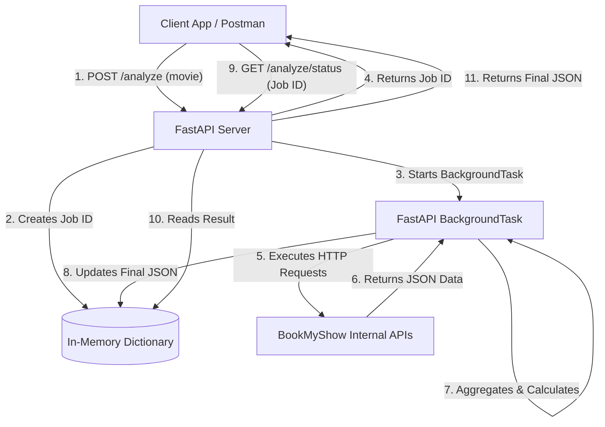

# BookMyShow Data Analyzer (Python/FastAPI)

This document details the architectural approach, tech stack, and data flow for the BookMyShow Analyzer project. The system is designed to handle the complexities of scraping data across multiple regions without timing out client requests, and crucially, **without relying on any external dependencies like Redis or databases**.

---

## 1. Architecture Overview

Because data acquisition from BookMyShow across all states and cities is a time-consuming process, the architecture is built around an **Asynchronous Job-Queue Pattern**. To avoid external dependencies, we use FastAPI's built-in `BackgroundTasks` and an in-memory dictionary to track job states.



---

## 2. Tech Stack (Zero External Dependencies)

| Component | Technology | Description & Justification |
| :--- | :--- | :--- |
| **Language** | Python 3.11+ | The industry standard for data processing and REST APIs. |
| **API Framework** | FastAPI | High performance, built-in async/await support, and automatic OpenAPI (Swagger) docs. |
| **Scraping Engine** | `requests` (Python) | Direct API calls using custom headers to bypass blocking. Faster and less memory-intensive than headless browsers. |
| **Async Execution** | FastAPI `BackgroundTasks` | Built directly into FastAPI. Allows a function to run in the background after the HTTP response has been returned. No Celery required. |
| **State Management** | Python `dict` (In-Memory) | A global Python dictionary maps `job_id` to its status and final result. No Redis or external DB required. |

---

## 3. Installation & Setup

### Installing Python
You must have Python 3.11 or higher installed. 
- **Mac**: `brew install python`
- **Windows**: Download the installer from [python.org](https://www.python.org/downloads/) (ensure you check "Add Python to PATH" during installation).
- **Linux (Ubuntu/Debian)**: `sudo apt install python3 python3-pip python3-venv`

### Project Setup
1. **Clone or navigate to the project directory:**
   ```bash
   cd path/to/java-bms
   ```

2. **Create a Virtual Environment (Recommended):**
   ```bash
   python3 -m venv venv
   ```

3. **Activate the Virtual Environment:**
   - On **Mac/Linux**: `source venv/bin/activate`
   - On **Windows**: `venv\Scripts\activate`

4. **Install Dependencies:**
   ```bash
   pip install -r requirements.txt
   ```

---

## 4. How to Run

1. **Start the FastAPI Server:**
   ```bash
   python3 main.py
   ```
   *(Alternatively: `uvicorn main:app --reload`)*

2. **Access the API Documentation:**
   Open your browser and navigate to [http://127.0.0.1:8000/docs](http://127.0.0.1:8000/docs). This provides an interactive Swagger UI to test the endpoints.

---

## 5. The Scraping Strategy (Core Logic)

BookMyShow uses internal APIs heavily. The most efficient way to get accurate data is through **direct HTTP requests** mimicking the browser's network patterns.

### Workflow:
1. **Initialize Job:** FastAPI creates a background task and immediately returns a Job ID.
2. **Fetch Regions (Cities):** The scraper hits the regions API to discover available cities.
3. **Iterate Regions:** The script loops through the cities, hitting the movies API to find the target movie.
4. **Fetch Showtimes:** For matched movies, the script hits the Primary-Static and Primary-Dynamic APIs to pull theater schedules and live seat availability.
5. **Extract Data:** Parse the JSON responses to extract: Theater Name, Capacity, Booked Seats, and Ticket Price.
6. **Calculate & Aggregate:** Calculate `Occupancy`, `Occupancy Percentage`, and `Net Collection`.
7. **Update State:** Save the final aggregated JSON to the in-memory dictionary.

---

## 6. API Specifications

### Endpoint 1: Submit Analysis Job
Triggers the background scraping process.

*   **URL:** `POST /api/v1/analyze`
*   **Request Body:**
    ```json
    {
      "movieName": "Peddi"
    }
    ```
*   **Response (202 Accepted):**
    ```json
    {
      "jobId": "b4a5-c8e06ee69cd7",
      "status": "PROCESSING",
      "message": "Scraping job initiated. Check status using the jobId."
    }
    ```

### Endpoint 2: Check Status & Get Results
Used to poll for the completed data.

*   **URL:** `GET /api/v1/analyze/{jobId}`
*   **Response - Pending (200 OK):**
    ```json
    {
      "jobId": "b4a5-c8e06ee69cd7",
      "status": "PROCESSING"
    }
    ```
*   **Response - Completed (200 OK):** *(Matches your requested schema)*
    ```json
    {
      "jobId": "b4a5-c8e06ee69cd7",
      "status": "COMPLETED",
      "data": {
        "movie": "Peddi",
        "lastUpdated": "2026-06-23T12:00:00Z",
        "states": { ... }
      }
    }
    ```

---

## 7. BookMyShow Internal API Reference

> [!CAUTION]
> The following cURL requests are the exact internal API calls made by the BookMyShow frontend. These headers must be preserved in the Python `requests` calls to avoid being blocked.

### All Cities(regions) API

```bash
curl 'https://in.bookmyshow.com/api/explore/v1/discover/regions' \
-H 'sec-ch-ua-platform: "macOS"' \
-H 'Referer: https://in.bookmyshow.com/explore/home/hyderabad' \
-H 'sec-ch-ua: "Google Chrome";v="149", "Chromium";v="149", "Not)A;Brand";v="24"' \
-H 'sec-ch-ua-mobile: ?0' \
-H 'baggage: sentry-environment=production,sentry-release=release_310,sentry-public_key=4d17a59c2597410e714ab31d421148d9,sentry-trace_id=0c2fbd6b5b38457a905c35e17d9d0a98,sentry-transaction=%2Fexplore%2Fhome%2F%3AregionSlug%3F,sentry-sampled=false,sentry-sample_rand=0.5787501972965,sentry-sample_rate=0.001' \
-H 'sentry-trace: 0c2fbd6b5b38457a905c35e17d9d0a98-acdb828091d264e5-0' \
-H 'User-Agent: Mozilla/5.0 (Macintosh; Intel Mac OS X 10_15_7) AppleWebKit/537.36 (KHTML, like Gecko) Chrome/149.0.0.0 Safari/537.36' \
-H 'Accept: application/json, text/plain, */*'
```
*Response: `jsons/cities.json`*

### Movies By City

```bash
curl 'https://in.bookmyshow.com/api/explore/v1/discover/movies-vijayawada?region=VIJA&cat=MT&embedded=true&lat=16.519&lon=80.6215' \
-H 'accept: application/json, text/plain, */*' \
-H 'accept-language: en-GB,en-US;q=0.9,en;q=0.8' \
-H 'baggage: sentry-environment=production,sentry-release=release_310,sentry-public_key=4d17a59c2597410e714ab31d421148d9,sentry-trace_id=37010b60c3734e14a09c6020f71a2324,sentry-transaction=%2Fexplore%2F%3Apath%3F%2F*,sentry-sampled=false,sentry-sample_rand=0.8289400292966069,sentry-sample_rate=0.001' \
-b '_ga=GA1.1.1564755255.1766573496; le=smlcodes%40gmail.com; lm=; bmsId="1.61267030.1782201813946"; _cfuvid=67tCTv.fXUumqeEt4EgOYQjgRxk3g_VI3wPoS.kNmM0-1782201813.8910978-1.0.1.1-3s4qzSYIv7i4E5mZhPlbCS_y9ubRDAC207PSqKQYv54; _gcl_au=1.1.1461127957.1782201815; WZRK_G=4c77ce060bbe4a8e8a447c1f2d2ade81; cf_clearance=2PBkIMOAIXrp9PLjWfVqpc5aDyCohaE9ZfzklR4iNsU-1782201815-1.2.1.1-qrURCDNLMdctOLP6iMnWOI3GJNEl8rnOqxfA5XFUeS9TnHikN8RPVJqEbQ4vMYRrK05LgwOXGzaKB9Hr3TNlLWZWKg9VupauTjcjQAdP39W31JyJDS4c2Zf_nVqYBStJRxNlqr.EmUuTcVaqfciaG3.pb86sXwKkuMKJjkxd6jN1rJrnhdbPAxsI2ROtxrr0u5iz6zTwpDXm0fXown_EaDuOQtAkXwewfNRk0Srh9C4JiWsvVi1V2l.D.TBqTYy_TU4GgfvVDrpVMhZ9j2JMg6qCH6fXHRcJfyaw7IKk61j1m3g7YqKGVEsFw9m_nFsnl522oecwuJ0gNkE0A9EoNw; __cf_bm=6H7yy058I_KqrQMphsKeNt0PQ.TYWGU__gdj.ISfooE-1782201815.0774925-1.0.1.1-59r7qti.5UV3ojyyoeDLP57VtYXkQhMPISmwKrIIWuN_hnJjZ1kvQ8FNuRX8xNWv7jIrc7gmEPPVMJa2APzRKtFgzeXELQIaTj_HcupMzeMZHssFCh9E5X6MnUhcDH7H; preferences=%7B%22ticketType%22%3A%22M-TICKET%22%7D; AMP_TOKEN=%24NOT_FOUND; tvc_bmscookie=GA1.2.1564755255.1766573496; tvc_bmscookie_gid=GA1.2.368877641.1782201819; platform=%7B%22segments%22%3A%22%22%7D; cto_bundle=jqi5qF8lMkZFc3g0VDVucW00QUolMkZiQzNSSFZOMmZsalpiWm5IcEo5SG5oZkh2dElyUEtYWXVmZ1Uzakg0VFpud01scE9KJTJCM3BrckklMkZtZFM0Y2pzNWxjVldhSElqcmRldFpGSHZzUDY2a1JINjdNZXQ1YVJYVmhoY0tSN1FFNTM1a2hxeDVNS1dNeDNxQ0ZWaVJkUCUyRkYyR3I0UjdBJTNEJTNE; WZRK_S_RK4-47R-98KZ=%7B%22p%22%3A2%2C%22s%22%3A1782201815%2C%22t%22%3A1782201971%7D; geoHash=%22%22; geolocation=%7B%22x-location-shared%22%3Afalse%2C%22x-location-selection%22%3A%22manual%22%2C%22timestamp%22%3A1782202121676%7D; rgn=%7B%22regionCode%22%3A%22VIJA%22%2C%22regionName%22%3A%22Vijayawada%22%2C%22subCode%22%3A%22%22%2C%22subName%22%3A%22%22%2C%22regionNameSlug%22%3A%22vijayawada%22%2C%22regionCodeSlug%22%3A%22vija%22%2C%22Lat%22%3A%2216.519%22%2C%22Long%22%3A%2280.6215%22%2C%22GeoHash%22%3A%22tfc%22%2C%22Seq%22%3A%2299%22%2C%22subtitle%22%3A%22%22%2C%22countryCode%22%3A%22IN%22%7D; _gat_UA-27207583-8=1; _ga_84T5GTD0PC=GS2.1.s1782201815$o7$g1$t1782202122$j59$l0$h0' \
-H 'priority: u=1, i' \
-H 'referer: https://in.bookmyshow.com/explore/movies-vijayawada?cat=MT' \
-H 'sec-ch-ua: "Google Chrome";v="149", "Chromium";v="149", "Not)A;Brand";v="24"' \
-H 'sec-ch-ua-mobile: ?0' \
-H 'sec-ch-ua-platform: "macOS"' \
-H 'sec-fetch-dest: empty' \
-H 'sec-fetch-mode: cors' \
-H 'sec-fetch-site: same-origin' \
-H 'sentry-trace: 37010b60c3734e14a09c6020f71a2324-9b6fa47c39b5581e-0' \
-H 'true-client-ip: 14.195.55.30' \
-H 'user-agent: Mozilla/5.0 (Macintosh; Intel Mac OS X 10_15_7) AppleWebKit/537.36 (KHTML, like Gecko) Chrome/149.0.0.0 Safari/537.36' \
-H 'x-advertiser-id: 1293822020505699555' \
-H 'x-app-code: WEB' \
-H 'x-bms-id: 1.61267030.1782201813946' \
-H 'x-geohash: tfc' \
-H 'x-latitude: 16.519' \
-H 'x-location-selection: manual' \
-H 'x-longitude: 80.6215' \
-H 'x-platform: WEB' \
-H 'x-platform-code: DESKTOP-WEB' \
-H 'x-region-code: VIJA' \
-H 'x-region-slug: vijayawada' \
-H 'x-segments;'
```
*Response: `jsons/movies-by-city.json`*

### Showtimes (Primary Static & Dynamic)

**GET Request URLs**
- Static: `https://in.bookmyshow.com/api/movies-data/v4/showtimes-by-event/primary-static?eventCode=ET00439772&dateCode=&isDesktop=true&regionCode=VIJA&xLocationShared=false&memberId=&lsId=&subCode=&lat=16.519&lon=80.6215`
- Dynamic: `https://in.bookmyshow.com/api/movies-data/v4/showtimes-by-event/primary-dynamic?eventCode=ET00439772&dateCode=&isDesktop=true&regionCode=VIJA&xLocationShared=false&memberId=&lsId=&subCode=&lat=16.519&lon=80.6215`

```bash
curl 'https://in.bookmyshow.com/api/movies-data/v4/showtimes-by-event/primary-static?eventCode=ET00439772&dateCode=&isDesktop=true&regionCode=VIJA&xLocationShared=false&memberId=&lsId=&subCode=&lat=16.519&lon=80.6215' \
-H 'x-app-code: WEB' \
-H 'sec-ch-ua-platform: "macOS"' \
-H 'x-geohash: tfc' \
-H 'sec-ch-ua: "Google Chrome";v="149", "Chromium";v="149", "Not)A;Brand";v="24"' \
-H 'sec-ch-ua-mobile: ?0' \
-H 'x-lsid;' \
-H 'x-latitude: 16.519' \
-H 'x-region-slug: vijayawada' \
-H 'sentry-trace: 6f6c27227f3a40f2becdf6e473eb5ee1-8f7cd2032097ffc2-0' \
-H 'baggage: sentry-environment=production,sentry-release=release_310,sentry-public_key=4d17a59c2597410e714ab31d421148d9,sentry-trace_id=6f6c27227f3a40f2becdf6e473eb5ee1,sentry-transaction=%2Fmovies%2F%3AregionNameSlug%2F%3AmovieNameSlug%2Fbuytickets%2F%3AeventCode%2F%3AshowDate%3F,sentry-sampled=false,sentry-sample_rand=0.5502271786866201,sentry-sample_rate=0.001' \
-H 'Accept: application/json, text/plain, */*' \
-H 'x-longitude: 80.6215' \
-H 'Referer: https://in.bookmyshow.com/movies/vijayawada/peddi/buytickets/ET00439772/' \
-H 'User-Agent: Mozilla/5.0 (Macintosh; Intel Mac OS X 10_15_7) AppleWebKit/537.36 (KHTML, like Gecko) Chrome/149.0.0.0 Safari/537.36' \
-H 'x-location-selection: manual' \
-H 'x-region-code: VIJA'
```

---

## 8. Data Output Format

Generates hierarchical JSON with:
```
Movie
  └── City
       └── Theater
            └── Show Time
                 ├── totalSeats
                 ├── occupied
                 └── amount (revenue)
```

**Output Example:**
```json
{
  "movie": "Movie Name",
  "city": {
    "City Name": {
      "Theater Name": {
        "Show: 10:00 AM": {
          "totalSeats": 600,
          "occupied": 200,
          "amount": 30000
        }
      }
    }
  }
}
```

## Use Cases
- **Theater Analytics**: Track occupancy patterns
- **Revenue Analysis**: Calculate daily revenue projections
- **Market Research**: Compare movie popularity across cities
- **Ticketing Insights**: Monitor real-time seat availability